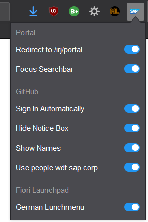

# sap-addon

## install
You can find the xpi of this addon in the corresponding folder of this repository to install in Firefox (just drag into browser or use tools in `about:addons` to install from file).
https://github.com/nikolockenvitz/sap-addon/tree/master/xpi

There is no version published to Chrome Web Store because there is a registration fee of $5.

## current features
* `portal.wdf.sap.corp`
  * redirect from login page (`/home`) to main page (`/irj/portal`)
  * focus the search bar automatically when loading page
* `github.wdf.sap.corp` / `github.tools.sap`
  * sign in automatically
  * hide yellow notice box
  * show name instead of user id (inspired by https://github.com/cgrail/github-chrome-fullname)
  * get name from `people.wdf.sap.corp` (use GitHub only as a fallback)
  * names are cached in local storage
* `fiorilaunchpad.sap.com` <!-- it's the Fiori Lunchpad ;) name created by Erik Jansky -->
  * show lunchmenu in German (even if default language is English)

All features are enabled by default but can be disabled in the settings popup.

## install [dev]
Download or clone this repository.

### Firefox
Open `about:debugging` and switch to `This Firefox` ([about:debugging#/runtime/this-firefox](about:debugging#/runtime/this-firefox)).
Click button `Load Temporary Add-on...` in top right corner.
Select `manifest.json` of this repository.

This makes the add-on available until you close/restart Firefox.

### Chrome
Open `chrome://extensions/` and enable `Developer mode` in the top right corner.
Click button `Load unpacked` in top left corner.
Select this folder.
