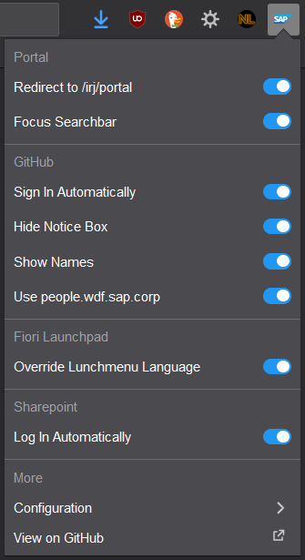
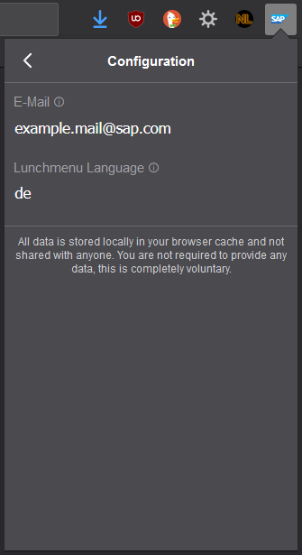

# sap-addon

<!-- SHIELD IO BADGES INSTALL START -->

<!-- SHIELD IO BADGES INSTALL END -->

Install by clicking on the badge above.
Updates are handled automatically.

## current features

* `portal.wdf.sap.corp`
  * redirect from login page (`/home`) to main page (`/irj/portal`)
  * focus the search bar automatically when loading page
* `github.wdf.sap.corp` / `github.tools.sap`
  * sign in automatically
  * hide yellow notice box
  * show name instead of user id (inspired by https://github.com/cgrail/github-chrome-fullname)
  * get name from `people.wdf.sap.corp` (use GitHub only as a fallback)
    * names are cached in local storage
    * also some metadata is stored to be able to clean the cache based on usage later
* `fiorilaunchpad.sap.com` <!-- it's the Fiori Lunchpad ;) name created by Erik Jansky -->
  * override language of lunchmenu (by default German) so that you will see it e.g. in German even if language in the Fiori Launchpad settings is set to English
    * language can be configured
    * currently supports `de` and `en`
    * other values will work too but you will see a warning (just contact me if you have other valid values and I will add them as well)
* `sap-my.sharepoint.com` / `login.microsoftonline.com`
  * log in automatically
  * sometimes e-mail address is needed to log in, you can specify it in configuration

All features are enabled by default but can be disabled in the settings popup.

## feedback, contribute, ...
Feel free to send feedback, share any ideas of what you think should be improved or can be added.

Please also report if you encounter bugs or things that are not working as you expect.

If you want to help, just contact me or open a pull request.
Check out [CONTRIBUTING.md](https://github.com/nikolockenvitz/sap-addon/blob/master/CONTRIBUTING.md#readme) for more details and local setup instructions.
