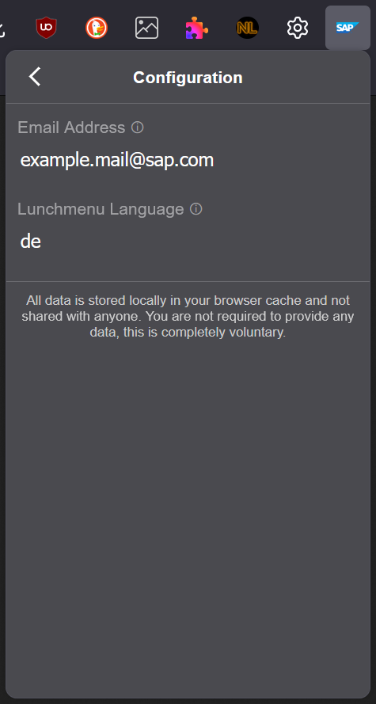

  

  <picture >
    <source media="(prefers-color-scheme: dark)" srcset="./assets/sap-addon-2-dark-mode.png">
    <source media="(prefers-color-scheme: light)" srcset="./assets/sap-addon-2-light-mode.png">
    
  </picture>
  
  

  <h3 align="center" style="margin-top: 0;">SAP Addon</h3>

  

    Firefox/Chrome Extension for SAP internal webpages
     
    <a href="#features">Features</a>
    ·
    <a href="#contribute">Contribute</a>
    ·
    <a href="https://github.com/nikolockenvitz/sap-addon/tree/main/docs#readme">Documentation</a>
  

<h3 align="center">Installation</h3>

<!-- SHIELD IO BADGES INSTALL START -->

<!-- SHIELD IO BADGES INSTALL END -->

 
Install by clicking on the respective badge.
Updates are handled automatically.

 

## Features

* **Auto Login** on GitHub, Sharepoint, Stack Overflow, Mural, and some other pages
* Showing people's **full names on GitHub** instead of user IDs
* Find a full list of features with detailed descriptions <a href="https://github.com/nikolockenvitz/sap-addon/tree/main/docs#features">here</a>

All features are enabled by default but can be disabled in the settings popup.
Click on the addon's icon in your browser's toolbar to open the popup (see screenshots below).
After successful installation, you may want to configure everything and grant the optional permissions.
Learn more about this <a href="https://github.com/nikolockenvitz/sap-addon/tree/main/docs#optional-permissions">here</a>.

 

## Contribute

Contributions of any kind are highly appreciated - code, improvement ideas, bug reports, or feature requests.
If you want to help, just contact me or open a pull request.
Check out <a href="https://github.com/nikolockenvitz/sap-addon/blob/main/CONTRIBUTING.md#readme">CONTRIBUTING.md</a> for more details and local setup instructions.
