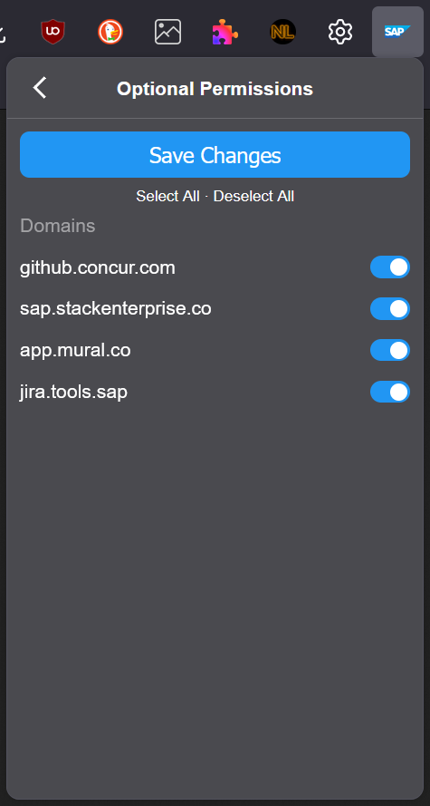
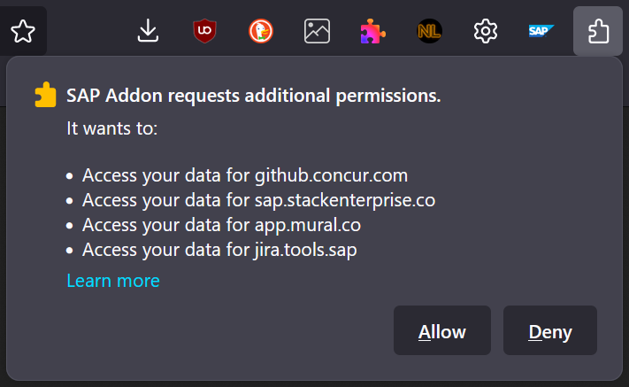

# Documentation <!-- omit in toc -->

## Table of Contents <!-- omit in toc -->

- [Features](#features)
  - [Auto Login](#auto-login)
  - [GitHub - People's Full Names Instead of User IDs](#github---peoples-full-names-instead-of-user-ids)
  - [GitHub - Hiding Yellow Announcement Banners](#github---hiding-yellow-announcement-banners)
  - [SAP Jira - Count Tips](#sap-jira---count-tips)
- [Settings Popup](#settings-popup)
- [Configuration](#configuration)
- [Optional Permissions](#optional-permissions)

## Features

### Auto Login

* works on following sites:
  * GitHub
  * Sharepoint, Outlook (Microsoft 365)
  * Stack Overflow (Stack@SAP)
  * Mural
  * Pluralsight
  * Artifactory (JFrog)
  * Deploy with Confidence (DwC)
* addon just clicks the login button to trigger the SSO process
* on some pages (Sharepoint, Mural), you need to enter your email address -> open the settings popup, go to *Configuration*, and enter your email address there to let the addon autofill it when required

### GitHub - People's Full Names Instead of User IDs

* most user ID occurrences will be replaced by the user's full name, which they configure in their GitHub profile
* names are cached in your browser's local storage

### GitHub - Hiding Yellow Announcement Banners

* adds buttons to yellow announcement banners to dismiss a particular message
* new messages will always appear
* if you dismissed a message by accident, you can show all banners again by clicking on the respective button in the settings popup

### SAP Jira - Count Tips

* show the ticket priority count and the unassigned count on the pagination

## Settings Popup

While all features are enabled by default, you can individually disable them.
To do so, open the settings popup by clicking on the addon's icon in your browser's toolbar.
The addon's icon might not be visible directly.
In this case, there is probably an icon for all extensions (often a puzzle tile icon) that opens a list of all your extensions, from which you can select *SAP Addon*.

In the settings popup, hover over an item to view further details.
A click on an item or the switch on the right, en-/disables the option.
Some entries may be grayed out.
This is because of permissions and requires you to manually grant the corresponding permission via *Optional Permissions* (see below).

## Configuration

At the bottom of the settings popup, you can navigate to *Configuration*.
You can enter your email address and SAP User ID there.
This is used for the auto login feature (for pages where you need to enter email / user ID).
The data is auto-saved and only stored in your browser's local storage.

## Optional Permissions

Some features will not work directly after the installation of the addon.
This is because of permissions:
As each website, on which the addon should run, needs to be granted permission by the user, your browser would ask you on every addon update that introduces a new feature/webpage.
When not granting this permission, the addon would be disabled by the browser.

This is why I decided to only add new features as optional permissions so that users of the addon are not bothered with permission requests that might completely disable the addon for them.

To also enable these optional permissions, open the settings popup and navigate to *Optional Permissions* at the bottom.
Click on *Select All* and save.
You can also select only specific websites or remove permissions later.

 
